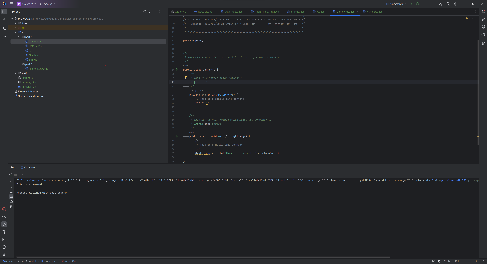
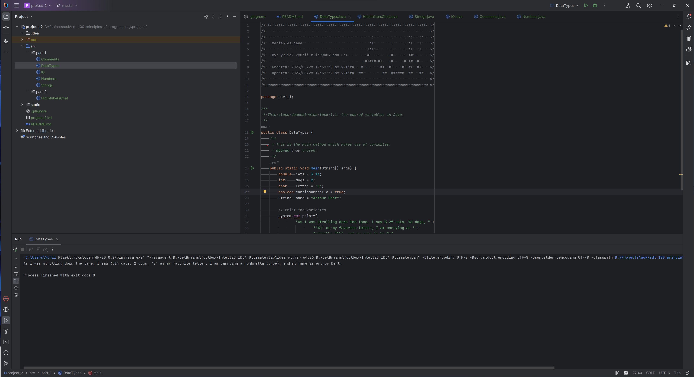
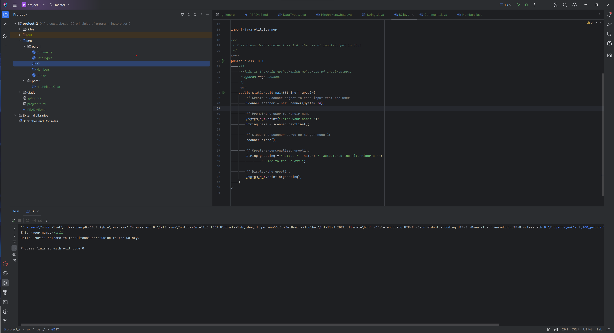
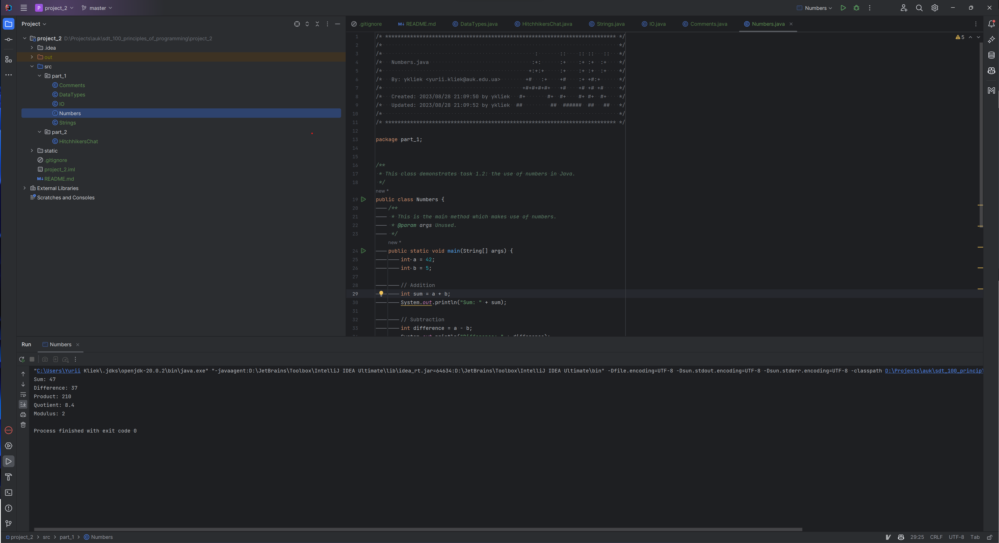
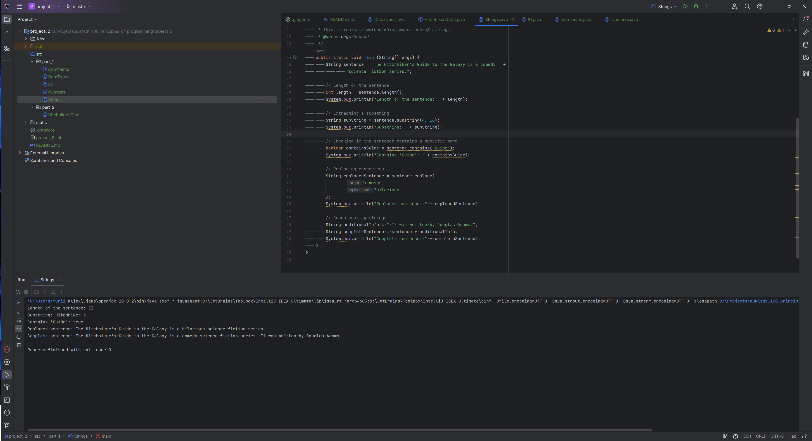
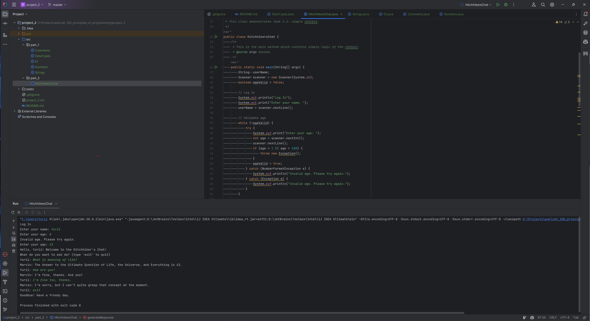
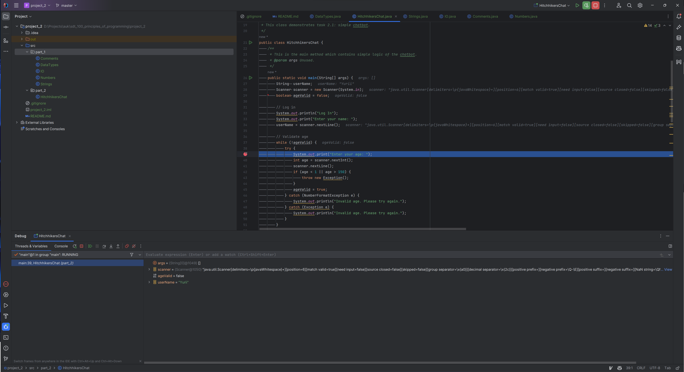

# UK SDT 100: Principles of Programming FA23: Project 2. I/O, Variables, Data types

This project demonstrates basic Java programming concepts using a theme related to "The Hitchhiker's Guide to the Galaxy."

## Table of Contents

- [Project Structure](#project-structure)
- [How to Run](#how-to-run)
- [Description](#description)

## Project Structure

The project is organized into two parts: `part_1` and `part_2`.

### part_1

This directory contains code snippets demonstrating various Java concepts.

- **Comments**: Examples of different types of comments in Java.

  Here's output from the `Comments.java` file:
  
- **DataTypes**: Examples of working with different data types.

  Here's output from the `DataTypes.java` file:
  
- **IO**: Examples of input and output operations.

  Here's output from the `IO.java` file:
  
- **Numbers**: Examples of number operations and calculations.

  Here's output from the `Numbers.java` file:
  
- **Strings**: Examples of string operations and manipulations.

  Here's output from the `Strings.java` file:
  

### part_2

This directory contains a simple interactive chat program related to "The Hitchhiker's Guide to the Galaxy."

- **HitchhikersChat**: A basic Java chat application demonstrating input, output, and basic conversation.

  Here's output from the `HitchhikersChat.java` file:
  

### Debugger usage
Here's a screenshot showing the usage of a debugger while running the \`HitchhikersChat\` program:


## How to Run

1. Navigate to the root directory of the project.
2. Compile and run the individual Java files in the `part_1` and `part_2` directories using your preferred Java compiler or development environment.

Example using the command line:

```shell
javac src/part_1/Comments.java
java src/part_1/Comments
```

## Description
This project showcases fundamental Java programming concepts and interaction using a theme inspired by "The Hitchhiker's Guide to the Galaxy." It covers topics such as comments, data types, input/output, numbers, strings, and simple interactive programming.

Feel free to explore the code files in the part_1 and part_2 directories to learn more about each concept and run the chat program to experience a basic interactive conversation.
